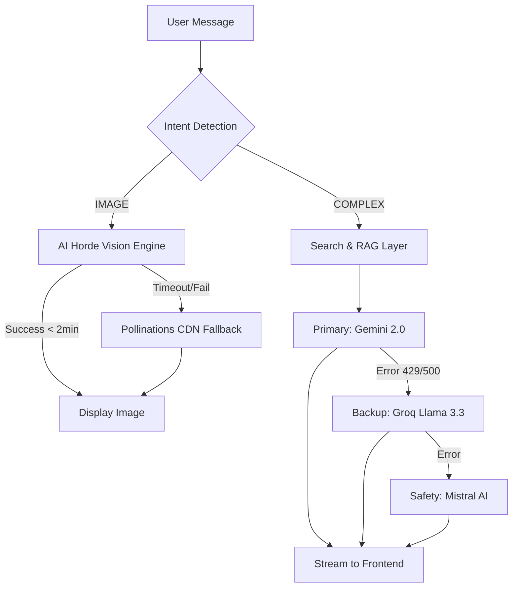
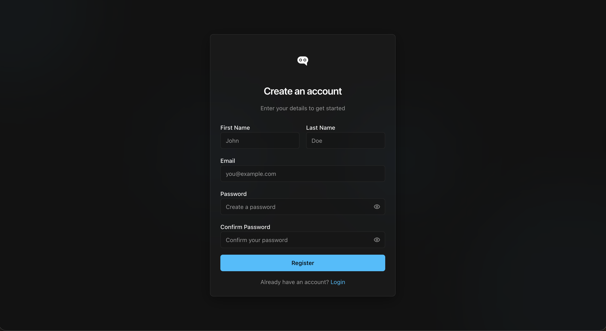
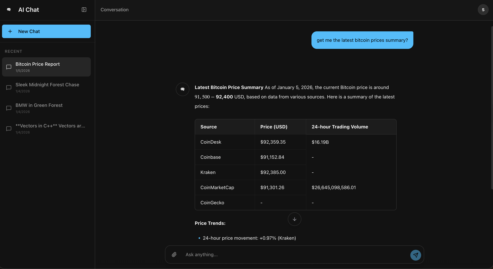

# ⚡ AI-ChatBot: The Resilient Multi-Model Orchestrator

AI-ChatBot is a production-grade AI platform that orchestrates multiple LLM and Vision providers into a single, high-availability interface. By utilizing a "Self-Healing" architecture, it ensures that user requests are fulfilled even when primary APIs encounter rate limits or outages.

---

## 🎯 The "Why"
Traditional AI apps are fragile; they rely on a single API. **this AI_ChatBot** solves this by implementing an intelligent routing layer that automatically rotates between **Gemini, Groq, and Mistral**, while managing a crowdsourced **AI Horde** vision engine with automated fallbacks.

---

## 🛠 Tech Stack
* **Frontend:** React 19, Tailwind CSS, Lucide Icons
* **Backend:** FastAPI (Python 3.11), Uvicorn
* **AI Orchestration:** Gemini 2.0 Flash, Groq (Llama 3.3), Mistral AI
* **Vision Engine:** AI Horde (Stable Diffusion), Pollinations CDN
* **Database & RAG:** MongoDB (Beanie ODM), DuckDuckGo Search API
* **Security:** SlowAPI (Rate Limiting), JWT Authentication, CORS Middleware

---

## 🔄 System Architecture & Flow

The following flowchart represents how OmniGen AI handles a user request from intent detection to final fulfillment:



## ✨ Key Features

* **🧠 Intelligent Intent Detection:** Employs a high-speed **Llama 3.1-8B** model to classify user requests into `IMAGE`, `SIMPLE`, or `COMPLEX` categories in $<200ms$, ensuring low-latency routing.
* **🎨 Resilient Vision Engine:** A custom-built **AI Horde** integration designed to manage deep queues with a strict 120s "Circuit Breaker" to prevent server hangs and ensure reliable image delivery.
* **🔍 Contextual RAG & Web Search:** Intelligently merges local vector database results with live **DuckDuckGo** web consensus to provide factually accurate, up-to-date responses.
* **🛡️ Production Security:** Enterprise-ready security featuring XSS protection, hardened security headers, and dynamic rate limiting to prevent API abuse.

## 🧠 Challenges & Solutions: The Horde Bottleneck

**The Challenge:** Integrating the **AI Horde** presented a significant reliability hurdle. Unlike centralized paid APIs, crowdsourced workers can drop jobs, queues often exceed 150+ positions, and aggressive polling quickly triggers `429 Too Many Requests` errors.

**The Solution:** I engineered a **Dynamic Polling & Safety Lifecycle** to manage these variables:

1.  **State-Based Polling:** Instead of fixed intervals, the system dynamically checks the `queue_position`. If the position is $>50$, it sleeps for 30s; if it drops below $10$, it sleeps for 5s. This stays within rate limits while maintaining responsiveness as the job nears completion.
2.  **Strict 120s Circuit Breaker:** I implemented a hard wall-clock timeout. If the Horde does not deliver within 2 minutes, the system intercepts the request and injects a high-speed **Pollinations CDN fallback**, ensuring the user receives a visual result without the server ever hanging.

## 🚀 Step-by-Step Setup

Follow these instructions to get a local copy up and running.

### 1. Clone the Repository

```bash
git clone (project_Clone_url)
```

### 2. Backend Configuration (FastAPI)
The backend manages AI orchestration and the Vision Engine.

```bash
# Navigate to server directory
cd server

# Create and activate a virtual environment
python -m venv venv
source venv/bin/activate  # Windows: venv\Scripts\activate

# Install all required Python packages
pip install -r requirements.txt
```

### 3. Frontend Configuration (React)
The frontend provides the interactive chat interface.

```bash
# Navigate to client directory
cd ../client

# Install Node dependencies
npm install
```

### 4. Environment Variables
Create a `.env` file in the /server folder and populate it with your API keys:

```bash
# --- SERVER CONFIG ---
PORT=8000
FRONTEND_URL=http://localhost:5173
ALLOWED_HOSTS=localhost,127.0.0.1,your-app.render.com

# --- AI PROVIDERS (LLMs) ---
# Gemini is primary, Groq is secondary, Mistral is fallback
GOOGLE_API_KEY=your_gemini_api_key_here
GROQ_API_KEY=your_groq_api_key_here
MISTRAL_API_KEY=your_mistral_api_key_here

# --- VISION ENGINE (AI HORDE) ---
# Use '0000000000' for anonymous (slow) or register at stablehorde.net for a free key
AI_HORDE_KEY=0000000000
HF_TOKEN=your_huggingface_token_here

# --- SEARCH & DATA ---
# Get this from serper.dev (free tier available)
SERPER_API_KEY=your_serper_api_key_here
# MongoDB Atlas Connection String
MONGO_URI=mongodb+srv://<user>:<password>@cluster.mongodb.net/omnigen?retryWrites=true&w=majority

# --- SECURITY ---
# Generate a secret using: openssl rand -hex 32
JWT_SECRET=your_super_secret_random_string
ALGORITHM=HS256
ACCESS_TOKEN_EXPIRE_MINUTES=60
```

Create a `.env` file in the /client folder and populate it with your API keys:
```bash
VITE_GOOGLE_CLIENT_ID=your_google_client_ID

VITE_GITHUB_CLIENT_ID=your_github_client_ID

VITE_API_URL="http://127.0.0.1:8000" or "your deployed live backend Url"
```

### 5. Running the Application
* **Open two terminal windows to run both services simultaneously:**

* **Terminal 1 (Backend): uvicorn main:app --reload**

* **Terminal 2 (Frontend): npm run dev**

### 6. API Response & Performance Metrics
## 📊 Performance Benchmarks
| Intent Type | Model Used | Avg. Latency | Fallback Logic |
| :--- | :--- | :--- | :--- |
| **Simple** | Llama 3.1-8B | ~150ms | N/A |
| **Complex** | Gemini 2.0 Flash | ~800ms | Groq (Llama 3.3) |
| **Image** | AI Horde | 30s - 120s |


### 7. 🛡️ API Error Handling & Fallback Strategy
## 🛡️ Resilience Strategy
This project implements a multi-tier fallback system to ensure 99.9% uptime for AI responses:
1. **Tier 1 (Primary):** Google Gemini 2.0 (High reasoning, multimodal).
2. **Tier 2 (Latency Fallback):** Groq Llama 3.3 (Triggered if Gemini latency > 2s).
3. **Tier 3 (Safety Fallback):** Mistral AI (Triggered if primary providers return 429 or 500 errors).


[](https://ai-chatbot-frontend-yq89.onrender.com)


## 🖼️ Full Gallery

<details>
<summary>Click to view all screenshots</summary>
  
### Website Page


### Authentication Flow



### App Flow



</details>
