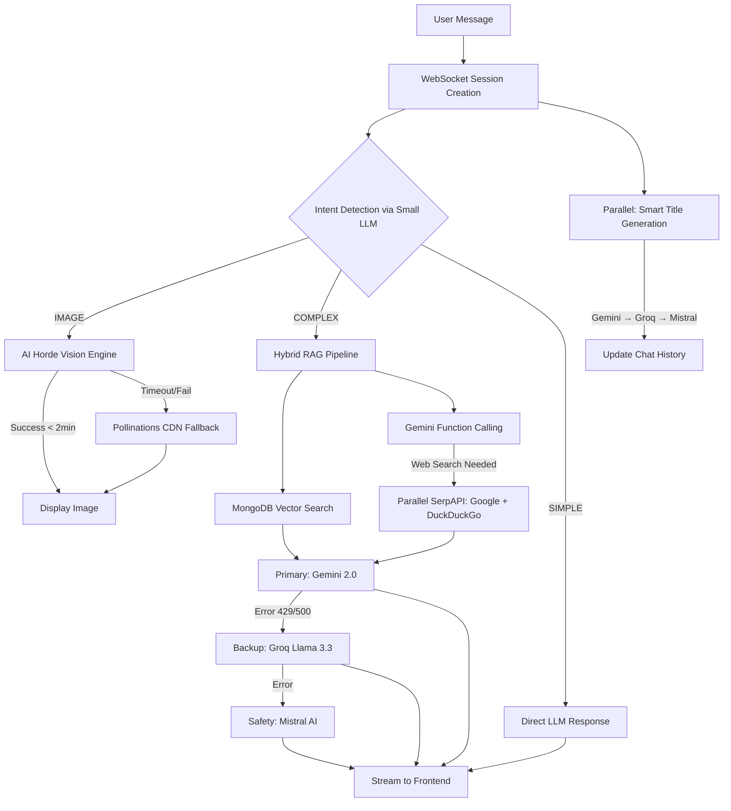
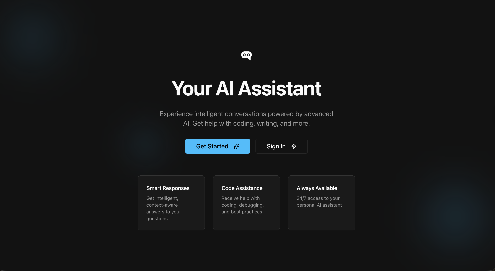
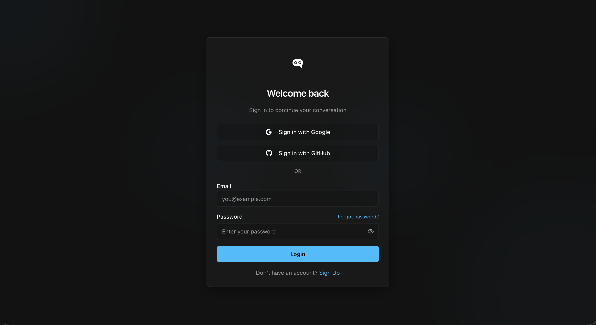
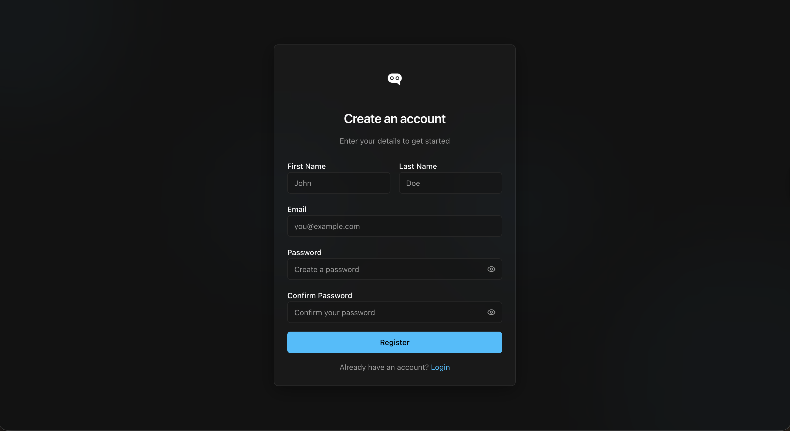
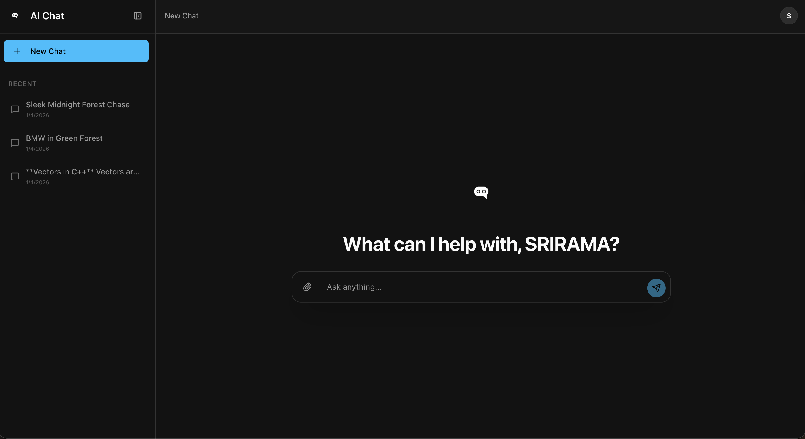
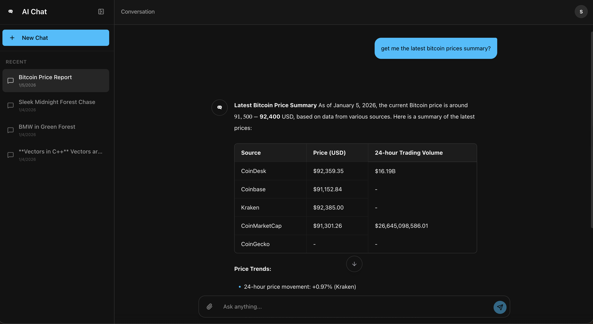

# ⚡ Multimodal AI Chatbot: Resilient AI Orchestration Platform

Multimodal AI Chatbot is a production-grade AI platform that orchestrates multiple LLM providers into a single, high-availability interface. By implementing a multi-tier failover architecture, it ensures 100% service availability even when primary APIs encounter rate limits or outages.

---

## 🎯 The "Why"
Traditional AI apps are fragile; they rely on a single API. **Multimodal AI Chatbot** solves this by implementing an intelligent orchestration layer that automatically routes between **Gemini, Groq, and Mistral**, while managing a crowdsourced **AI Horde** vision engine with automated fallbacks.

---

## 🛠 Tech Stack
* **Frontend:** React 19, TypeScript, Vite, Tailwind CSS
* **Backend:** FastAPI (Python 3.11), Uvicorn
* **Real-Time:** WebSockets (Socket.io) for asynchronous task streaming
* **AI Orchestration:** Gemini 2.0 Flash (with Function Calling), Groq (Llama 3.3), Mistral AI
* **Database & RAG:** MongoDB Atlas (Vector Search), Beanie ODM
* **Security:** Bcrypt Password Hashing, OAuth2.0 (Google/GitHub), SMTP OTP Verification, JWT

---

## 🔄 System Architecture & Flow

The following flowchart represents how Multimodal AI Chatbot handles a user request from intent detection to final fulfillment:


```mermaid
graph TD
    A[User Message] --> B[WebSocket Session Creation]
    B --> C{Intent Detection via Small LLM}
    C -- "IMAGE" --> D[AI Horde Vision Engine]
    D -- "Success < 2min" --> E[Display Image]
    D -- "Timeout/Fail" --> F[Pollinations CDN Fallback]
    F --> E
    
    C -- "COMPLEX" --> G[Hybrid RAG Pipeline]
    G --> H[MongoDB Vector Search]
    G --> I[Gemini Function Calling]
    I -- "Web Search Needed" --> J[Parallel SerpAPI: Google + DuckDuckGo]
    J --> K[Primary: Gemini 2.0]
    H --> K
    K -- "Error 429/500" --> L[Backup: Groq Llama 3.3]
    L -- "Error" --> M[Safety: Mistral AI]
    K --> N[Stream to Frontend]
    L --> N
    M --> N
    
    C -- "SIMPLE" --> O[Direct LLM Response]
    O --> N
    
    B --> P[Parallel: Smart Title Generation]
    P -- "Gemini → Groq → Mistral" --> Q[Update Chat History]
```

## ✨ Key Features

### 🧠 AI Orchestration & Resilience
* **Multi-LLM Failover System:** Architected a three-tier failover architecture (Gemini → Groq → Mistral) maintaining 100% service availability during API outages
* **Intelligent Intent Detection:** Employs a high-speed small LLM model to classify user requests into `IMAGE`, `SIMPLE`, or `COMPLEX` categories in <200ms, ensuring low-latency routing
* **Gemini Function Calling:** Leverages native function calling to dynamically decide between web search and image generation workflows

### 🔍 Hybrid RAG Pipeline
* **Contextual Search:** Combines MongoDB Vector Embeddings with real-time web data to provide context-aware responses from both uploaded documents and live information
* **Parallel Web Search:** Integrates SerpAPI to fetch results simultaneously from Google and DuckDuckGo, merging consensus data for factually accurate responses
* **Document Processing:** Supports multimodal inputs including PDFs and images with vector embedding storage for semantic search

### 🎨 Resilient Vision Engine
* **AI Horde Integration:** Custom-built crowdsourced image generation with dynamic polling based on queue position
* **Circuit Breaker Pattern:** Implements a strict 120s timeout with automatic fallback to Pollinations CDN to prevent server hangs
* **Smart Polling:** Adaptive polling intervals (30s for queue >50, 5s for queue <10) to stay within rate limits while maintaining responsiveness

### 🔐 Identity Management System
* **Secure Authentication:** Bcrypt password hashing with custom SMTP-based OTP verification workflow
* **Social OAuth2.0:** Seamless integration with Google and GitHub login providers
* **JWT Authorization:** Token-based session management with configurable expiration

### ⚡ Asynchronous Architecture
* **WebSocket Streaming:** Real-time response streaming with parallel task execution
* **Concurrent Processing:** Simultaneous handling of intent detection, smart-title generation, and multimodal processing
* **Session Management:** Automatic chat session creation and history tracking

### 🖥️ Responsive Interface
* **Modern UI:** Tailwind CSS-powered responsive design with sidebar, navbar, and main content areas
* **Chat History Management:** Sidebar navigation for previous conversations and new chat creation
* **User Profile:** Integrated profile management and signout functionality in navbar

---

## 🧠 Technical Deep Dive: The Horde Bottleneck Challenge

**The Challenge:** Integrating the **AI Horde** presented a significant reliability hurdle. Unlike centralized paid APIs, crowdsourced workers can drop jobs, queues often exceed 150+ positions, and aggressive polling quickly triggers `429 Too Many Requests` errors.

**The Solution:** I engineered a **Dynamic Polling & Safety Lifecycle** to manage these variables:

1.  **State-Based Polling:** Instead of fixed intervals, the system dynamically checks the `queue_position`. If the position is >50, it sleeps for 30s; if it drops below 10, it sleeps for 5s. This stays within rate limits while maintaining responsiveness as the job nears completion.
2.  **Strict 120s Circuit Breaker:** I implemented a hard wall-clock timeout. If the Horde does not deliver within 2 minutes, the system intercepts the request and injects a high-speed **Pollinations CDN fallback**, ensuring the user receives a visual result without the server ever hanging.

---

## 🚀 Step-by-Step Setup

Follow these instructions to get a local copy up and running.

### 1. Clone the Repository

```bash
git clone (project_Clone_url)
```

### 2. Backend Configuration (FastAPI)
The backend manages AI orchestration, WebSocket connections, and the Vision Engine.

```bash
# Navigate to server directory
cd server

# Create and activate a virtual environment
python -m venv venv
source venv/bin/activate  # Windows: venv\Scripts\activate

# Install all required Python packages
pip install -r requirements.txt
```

### 3. Frontend Configuration (React)
The frontend provides the interactive chat interface with real-time WebSocket streaming.

```bash
# Navigate to client directory
cd ../client

# Install Node dependencies
npm install
```

### 4. Environment Variables
Create a `.env` file in the `/server` folder and populate it with your API keys:

```bash
# --- SERVER CONFIG ---
PORT=8000
FRONTEND_URL=http://localhost:5173
ALLOWED_HOSTS=localhost,127.0.0.1,your-app.render.com

# --- AI PROVIDERS (LLMs) ---
# Gemini is primary, Groq is secondary, Mistral is fallback
GOOGLE_API_KEY=your_gemini_api_key_here
GROQ_API_KEY=your_groq_api_key_here
MISTRAL_API_KEY=your_mistral_api_key_here

# --- VISION ENGINE (AI HORDE) ---
# Use '0000000000' for anonymous (slow) or register at stablehorde.net for a free key
AI_HORDE_KEY=0000000000
HF_TOKEN=your_huggingface_token_here

# --- SEARCH & DATA ---
# Get this from serper.dev (free tier available)
SERPER_API_KEY=your_serper_api_key_here
# MongoDB Atlas Connection String with Vector Search enabled
MONGO_URI=mongodb+srv://<user>:<password>@cluster.mongodb.net/omnigen?retryWrites=true&w=majority

# --- SECURITY ---
# Generate a secret using: openssl rand -hex 32
JWT_SECRET=your_super_secret_random_string
ALGORITHM=HS256
ACCESS_TOKEN_EXPIRE_MINUTES=60

# --- SMTP OTP VERIFICATION ---
SMTP_HOST=smtp.gmail.com
SMTP_PORT=587
SMTP_EMAIL=your_email@gmail.com
SMTP_PASSWORD=your_app_specific_password
```

Create a `.env` file in the `/client` folder:
```bash
VITE_GOOGLE_CLIENT_ID=your_google_client_ID
VITE_GITHUB_CLIENT_ID=your_github_client_ID
VITE_API_URL="http://127.0.0.1:8000"  # or your deployed backend URL
```

### 5. Running the Application
Open two terminal windows to run both services simultaneously:

**Terminal 1 (Backend):**
```bash
cd server
uvicorn main:app --reload
```

**Terminal 2 (Frontend):**
```bash
cd client
npm run dev
```

The application will be available at `http://localhost:5173`

---

## 📊 Performance Benchmarks
| Intent Type | Model Used | Avg. Latency | Fallback Logic |
| :--- | :--- | :--- | :--- |
| **Simple** | Small LLM (Intent) | ~150ms | Direct Response |
| **Complex** | Gemini 2.0 Flash | ~800ms | Groq (Llama 3.3) → Mistral |
| **Image** | AI Horde | 30s - 120s | Pollinations CDN |
| **Web Search** | SerpAPI (Parallel) | ~500ms | N/A |
| **Title Gen** | Gemini → Groq → Mistral | ~300ms | Multi-tier Fallback |

---

## 🛡️ Multi-Tier Failover Strategy
This project implements a resilient orchestration system to ensure 100% service availability:

1. **Tier 1 (Primary):** Google Gemini 2.0 Flash (High reasoning, multimodal, function calling)
2. **Tier 2 (Latency Fallback):** Groq Llama 3.3 (Triggered if Gemini returns 429/500 errors)
3. **Tier 3 (Safety Fallback):** Mistral AI (Final fallback if all primary providers fail)

This architecture applies to both **chat responses** and **smart title generation**, ensuring continuous operation even during provider outages.

---

## 🔄 Request Lifecycle
1. User sends message → WebSocket session created
2. Session initialization → Chat history retrieved
3. **Parallel Execution:**
   - Intent detection (small LLM)
   - Smart title generation (Gemini → Groq → Mistral)
   - RAG vector search in MongoDB
4. Based on intent:
   - **Image:** AI Horde (with fallback)
   - **Complex:** Gemini Function Calling → Web search if needed → LLM response with failover
   - **Simple:** Direct LLM response
5. Stream response to frontend via WebSocket

---

[](https://ai-chatbot-frontend-yq89.onrender.com)

---

## 🖼️ Full Gallery

<details>
<summary>Click to view all screenshots</summary>
  
### Website Page


### Authentication Flow



### App Flow



</details>

---

## 🏗️ Project Structure
```
multimodal-ai-chatbot/
├── client/                 # React + TypeScript + Vite frontend
│   ├── src/
│   │   ├── components/    # UI components (Sidebar, Navbar, Chat)
│   │   ├── contexts/      # WebSocket and Auth contexts
│   │   └── pages/         # Authentication and Chat pages
│   └── .env
├── server/                # FastAPI backend
│   ├── routes/            # API endpoints
│   ├── services/          # AI orchestration logic
│   ├── models/            # MongoDB models
│   └── .env
└── README.md
```

---

## 🤝 Contributing
Contributions are welcome! Please feel free to submit a Pull Request.

---

## 📝 License
This project is open source and available under the MIT License.

---

## 🔗 Links
- **Live Demo:** [ai-chatbot-frontend-yq89.onrender.com](https://ai-chatbot-frontend-yq89.onrender.com)
- **Report Issues:** [GitHub Issues](#)

---

**Built with ❤️ using React, TypeScript, FastAPI, and MongoDB**
